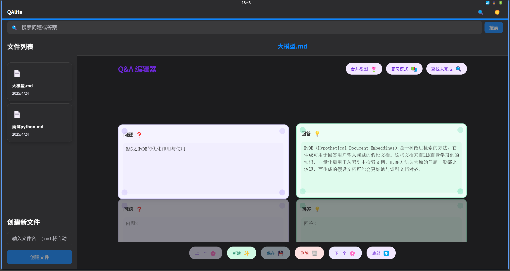
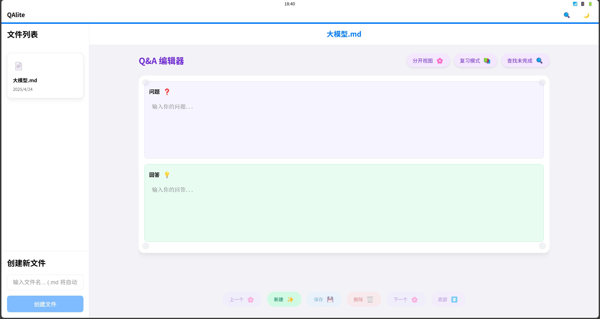
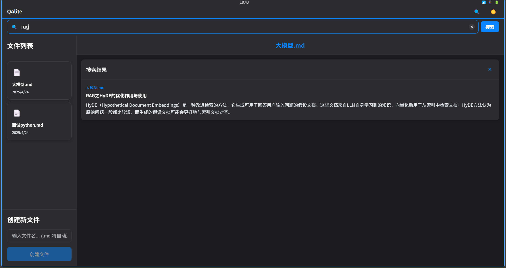
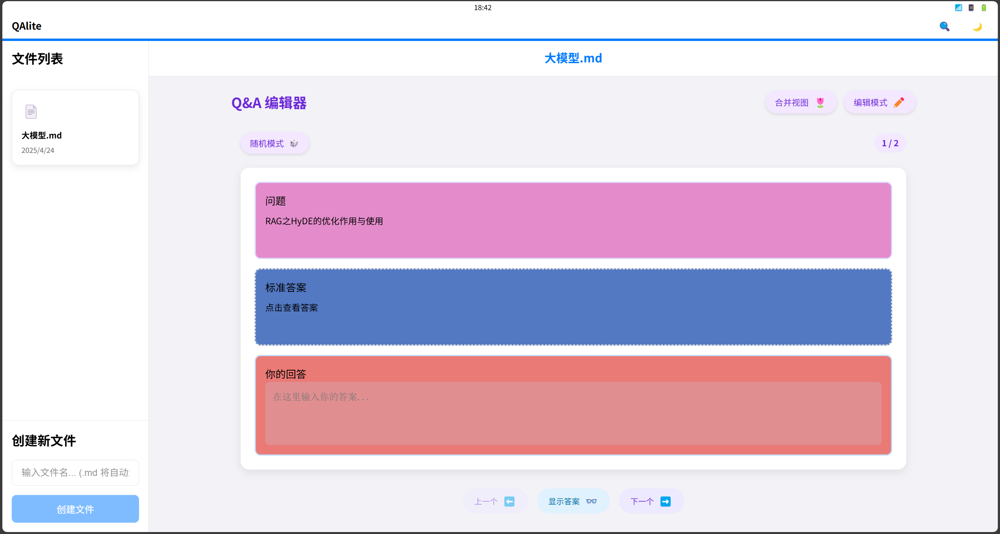

# QALite

#### 作者:XIK

一个轻量级的问答笔记应用，使用Vue 3前端和FastAPI后端，帮助您高效管理和复习知识点。
用于记录qa式问答，方便复习与记录面试所需要的问题，也可将用户记录上传给大模型，进行模型微调的qa记录软件。


## 项目展示
两种卡片记录方式：


搜索功能

复习功能



## 功能特点

- 创建和管理Markdown格式的问答笔记
- 编辑、删除和搜索问答对
- 支持分开视图和合并视图模式
- 支持复习模式，帮助记忆和学习
- 自动保存输入内容
- 简洁美观的界面

## 快速启动

### 使用Python启动器（推荐）

我们提供了一个便捷的Python启动器，可以一键启动前后端服务：

1. 运行 `python start.py` 或双击 `start.bat`
2. 从列表中选择现有的conda环境或手动输入环境名称
3. 确认后，启动器会自动：
   - 启动后端服务 (FastAPI)
   - 启动前端服务 (Vue + Vite)
   - 自动打开浏览器访问应用
4. 按 `Ctrl+C` 停止所有服务

启动器的主要优势：
- 自动检测和使用conda环境
- 实时显示前后端日志
- 自动记住上次使用的环境
- 支持Windows、macOS和Linux

### 手动启动

如果您想手动启动服务，请按照以下步骤操作：

#### 后端

1. 进入backend目录
2. 安装依赖: `pip install -r requirements.txt`
3. 启动服务: `python main.py` 或 `uvicorn main:app --reload --host 0.0.0.0 --port 8000`
4. 后端将在 http://localhost:8000 启动

#### 前端

1. 进入frontend目录
2. 安装依赖: `npm install`
3. 启动服务: `npm run dev`
4. 前端将在 http://localhost:5173 启动

# QAlite Docker 部署指南

## 部署步骤

1. 确保安装了 Docker 和 Docker Compose

2. 在项目根目录下运行以下命令启动服务：

```bash
docker-compose up -d
```

3. 等待容器构建和启动完成（首次启动可能需要几分钟）

4. 服务启动后，可以通过以下地址访问：
   - 前端：http://localhost:5173
   - 后端API：http://localhost:8000

## 查看日志

如果需要查看服务日志，可以运行：

```bash
# 查看所有服务日志
docker-compose logs

# 查看前端日志
docker-compose logs frontend

# 查看后端日志
docker-compose logs backend

# 实时查看日志
docker-compose logs -f
```

## 停止服务

停止服务但不删除容器：

```bash
docker-compose stop
```

停止服务并删除容器：

```bash
docker-compose down
```

停止服务并删除容器和数据卷（将删除所有QA数据！）：

```bash
docker-compose down -v
```

## 注意事项

1. 所有QA数据保存在Docker数据卷中，重启容器不会丢失数据
2. 如果修改了代码，需要重新构建容器：

```bash
docker-compose up -d --build
``` 

## 文件存储

所有的问答笔记以Markdown格式存储在 `backend/qa_files` 目录中，您可以直接使用文本编辑器或Markdown编辑器打开这些文件进行查看和编辑。

## 系统要求

- Python 3.8+
- Node.js 14+
- Conda环境管理器（使用启动器时）
- 依赖包：
  - 后端: fastapi, uvicorn, pandas, tabulate
  - 前端: vue3, vite

## 使用指南

### 编辑模式

- 创建新的问答对：点击"新建"按钮
- 导航：使用"上一个"和"下一个"按钮或鼠标滚轮
- 切换视图：使用"分开视图"/"合并视图"按钮
- 查找未完成：查找并跳转到未完成的问答对
- 删除：选择一个问答对后点击"删除"按钮

### 复习模式

- 进入复习模式：点击"复习模式"按钮
- 随机/顺序：选择复习顺序
- 显示/隐藏答案：控制答案的可见性
- 输入你的回答：在输入框中练习回答问题

## 项目结构

```
QALite/
├── backend/             # 后端代码
│   ├── main.py          # 主应用入口
│   ├── requirements.txt # 后端依赖
│   └── qa_files/        # 存储Markdown文件的目录
├── frontend/            # 前端代码
│   ├── src/             # Vue源代码
│   ├── package.json     # 前端依赖配置
│   └── index.html       # 前端入口HTML
├── start.py             # Python启动器
├── start.bat            # Windows批处理启动文件
└── README.md            # 项目说明文档
```

## Markdown格式

所有问答对以Markdown表格格式存储：

```markdown
| 问题  | 答案                          |
|-----|-------------------------------|
| 什么是防抖？ | 事件停止触发后延迟执行的函数  |
| 如何判断数组？ | `Array.isArray()` 或 `instanceof` |
```

## 故障排除

### 启动器问题

- **找不到conda环境**：确保已安装Conda并添加到环境变量，或手动输入环境名称
- **重置配置**：删除根目录下的 `qalite_config.json` 文件可重置环境配置
- **前端启动失败**：手动进入frontend目录运行 `npm install` 安装依赖

### 后端问题

- **依赖错误**：确保所选环境中已安装所需依赖 `pip install -r backend/requirements.txt`
- **端口占用**：如果8000端口被占用，修改后端代码中的端口配置

### 前端问题

- **页面加载错误**：检查浏览器控制台报错信息
- **无法连接后端**：确保后端服务已启动并监听正确的端口

## 许可证

[MIT License](LICENSE)

## 贡献

欢迎提交问题报告和改进建议！可以通过以下方式参与项目：

1. Fork项目并创建分支
2. 提交代码改进
3. 创建Pull Request

## 致谢

感谢所有为QALite项目做出贡献的开发者！